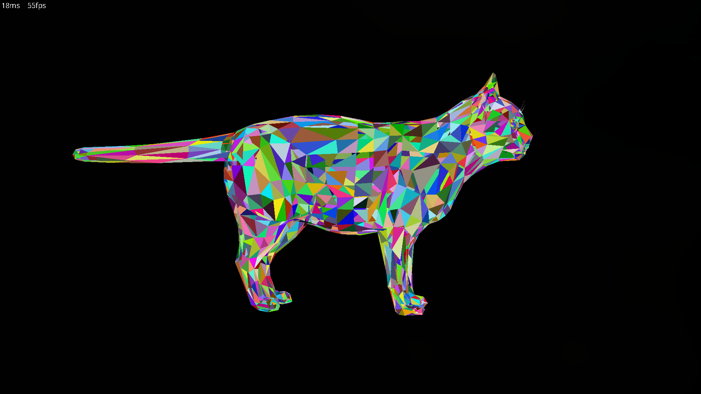
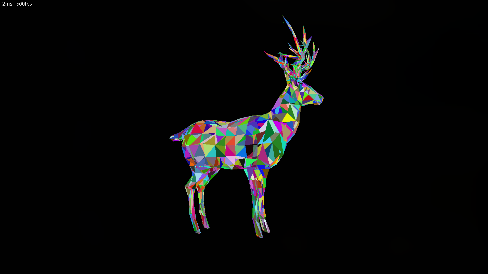
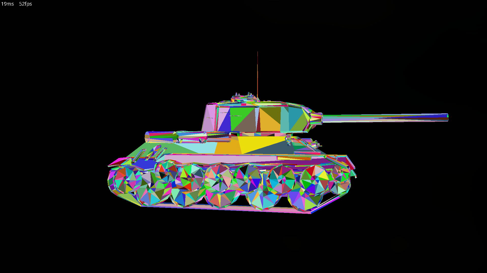
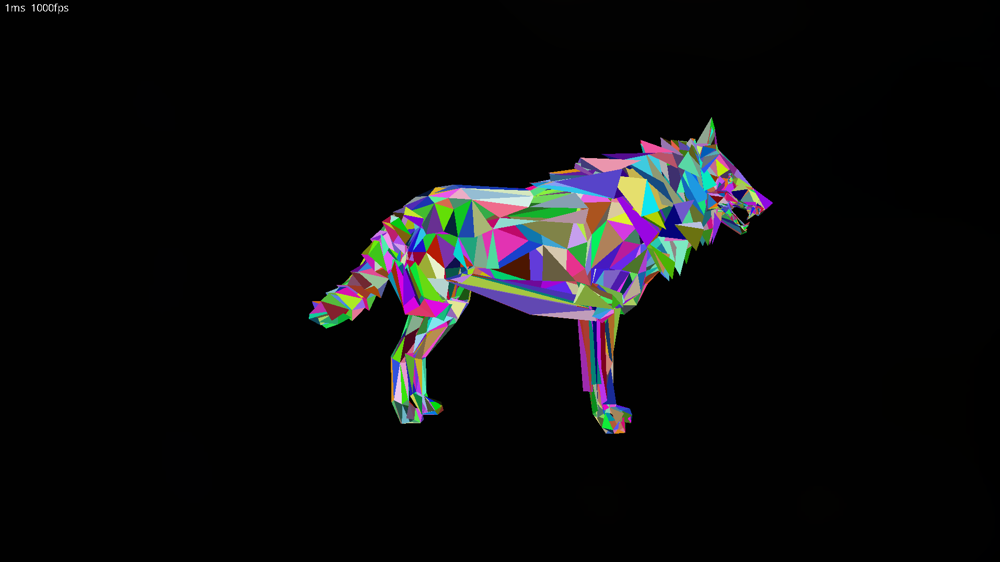

# Python
```
$ python renderer.py <objfilename>
```

# C++
```
$ make release
$ ./renderer <objfilename>
```

# Controls
| Key | Action |
|-----|--------|
| S | Zoom Out |
| W | Zoom In |
| A | Move Left |
| D | Move Right |
| Q | Move Up |
| E | Move Down |
| N | Switch between obj files in obj/ folder (won't work unless the filenames match) |

# Screenshots




